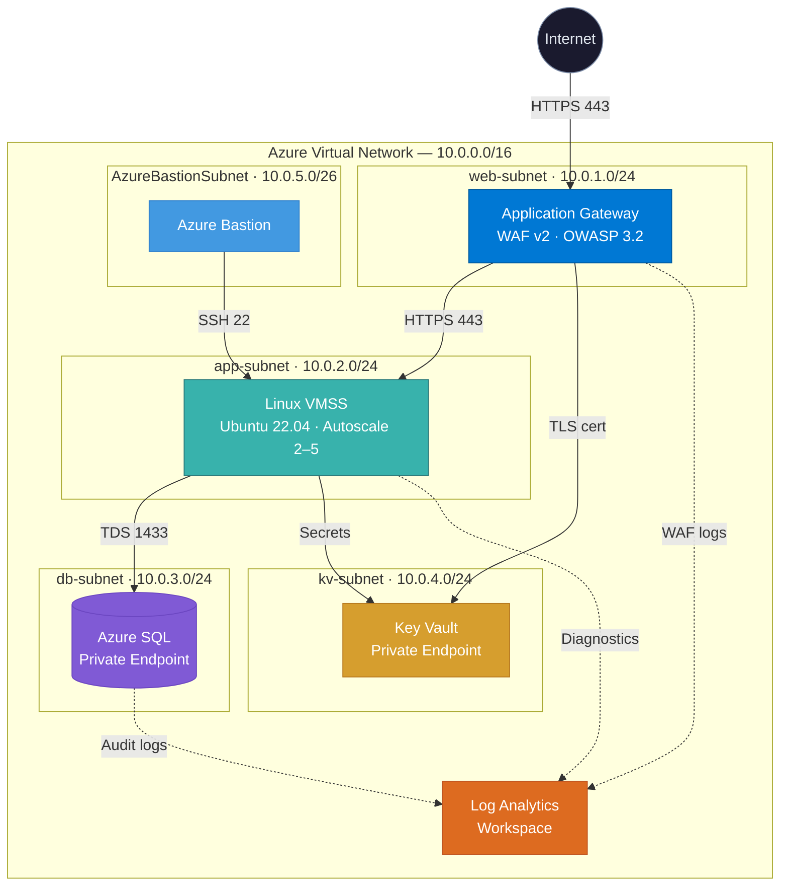

<div align="center">

# Azure 3-Tier Secure Architecture

**Production-grade infrastructure on Azure, defined entirely in Terraform.**

[](https://www.terraform.io/)
[](https://azure.microsoft.com/)
[](https://react.dev/)
[](https://www.typescriptlang.org/)
[](LICENSE)

A fully modular, security-hardened, three-tier web application stack on Azure — with an interactive architecture explorer built in React + TypeScript.

[Explore the Architecture →](https://github.com/xsol05/dunno-yet)&nbsp;&nbsp;·&nbsp;&nbsp;[View Terraform Code →](infra/)&nbsp;&nbsp;·&nbsp;&nbsp;[Interactive App →](app/)

</div>

---

## Architecture



## Highlights

| Layer | What's Deployed | Key Config |
|:------|:----------------|:-----------|
| **Web** | Application Gateway (WAF v2) | OWASP CRS 3.2 · Prevention mode · TLS from Key Vault |
| **App** | Linux VMSS (Ubuntu 22.04) | Autoscale 2–5 · Managed Identity · SSH-only |
| **Data** | Azure SQL (Private Endpoint) | Entra ID auth · TLS 1.2 · Audit logging |
| **Secrets** | Azure Key Vault (Premium) | RBAC-only · Purge protection · Private EP |
| **Network** | VNet + 5 NSGs | Deny-all baseline · Per-subnet rules |
| **Monitoring** | Log Analytics Workspace | WAF, SQL audit, NSG flow, diagnostics |
| **Access** | Azure Bastion (Standard) | Browser-based SSH · No public IPs on VMs |

## Tech Stack

<div align="center">

### Infrastructure


### Interactive Explorer App


</div>

## Project Structure

```
├── infra/                      # Terraform root module
│   ├── main.tf                 # Orchestrates all modules
│   ├── variables.tf            # Input variables
│   ├── outputs.tf              # Stack outputs
│   ├── providers.tf            # Provider versions & backend
│   ├── terraform.tfvars.example
│   ├── modules/
│   │   ├── networking/         # VNet, Subnets, NSGs, AppGw, Bastion
│   │   ├── compute/            # Linux VMSS, Autoscale, Managed Identity
│   │   ├── database/           # Azure SQL, Private Endpoint, Entra ID
│   │   └── keyvault/           # Key Vault, TLS cert, Private Endpoint
│   └── scripts/
│       └── bootstrap-backend.sh  # One-time remote state setup
│
├── app/                        # React architecture explorer
│   ├── src/
│   │   ├── App.tsx             # Main app with scroll-driven animations
│   │   ├── components/         # SVG diagram, icons
│   │   └── data/               # Infrastructure data model
│   └── ...
│
└── docs/                       # Static documentation site
```

## Getting Started

### Prerequisites

- [Terraform](https://developer.hashicorp.com/terraform/install) >= 1.5
- [Azure CLI](https://learn.microsoft.com/en-us/cli/azure/install-azure-cli) (authenticated via `az login`)
- [Node.js](https://nodejs.org/) >= 18 (for the explorer app)

### Deploy Infrastructure

```bash
# 1. Bootstrap remote state (one-time)
cd infra
bash scripts/bootstrap-backend.sh

# 2. Configure variables
cp terraform.tfvars.example terraform.tfvars
# Edit terraform.tfvars with your values

# 3. Deploy
terraform init
terraform plan -out=tfplan
terraform apply tfplan
```

### Run the Explorer App

```bash
cd app
npm install
npm run dev
```

> [!TIP]
> The interactive explorer visualizes every resource, connection, traffic flow, and NSG rule defined
> in the Terraform modules — no Azure subscription required to explore the architecture.

## Security Posture

This architecture follows Azure security best practices:

- **Zero public endpoints** on data-tier resources (SQL + Key Vault via Private Endpoints)
- **WAF in Prevention mode** with OWASP Core Rule Set 3.2
- **Deny-all NSG baseline** — only explicitly required traffic is allowed
- **Entra ID authentication** for Azure SQL (password auth can be fully disabled)
- **Managed Identities** — no credentials stored in code or config
- **Key Vault with RBAC** — no legacy vault access policies
- **TLS 1.2 minimum** enforced across all services
- **Audit logging** to centralized Log Analytics workspace

## Design Decisions

| Decision | Rationale |
|:---------|:----------|
| Modular Terraform | Each tier is independently testable and reusable |
| AzureRM 4.x | Latest provider with improved resource support |
| WAF v2 over Front Door | Simpler for single-region; upgrade path exists |
| VMSS over App Service | Full OS control; custom binary support |
| Private Endpoints | Eliminates public attack surface for data tier |
| Bastion over Jump Box | Managed service; no VM to patch |

---

<div align="center">

**Built with Terraform** · **Secured by design** · **Visualized in React**

</div>
